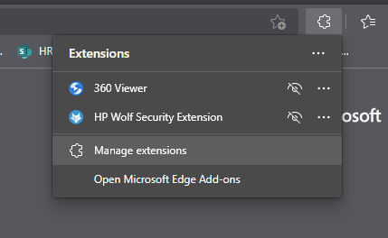
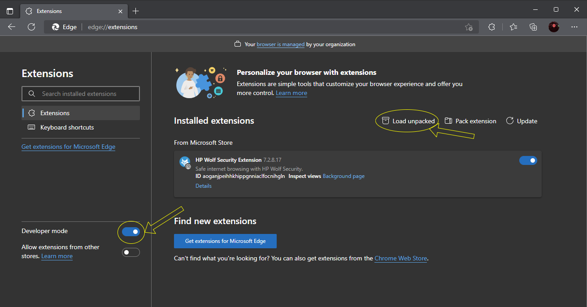
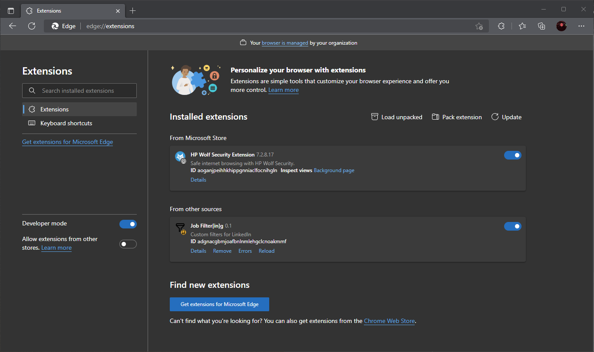

# Job Filter[in]g
Did you know that LinkedIn Job searches return up to 1,000 results? But what good is that if a user had to go through each one to find which roles they actually are qualified for? That would take up so much time and mental effort. However, if users had the option to filter for roles based on years of experience, they could easily focus their energy only on roles they have the necessary years of experience for. We are creating a browser extension to filter those results for you. 

## How to add this extension to your browser
1. From your prefered browser, click on Extensions icon then click on **`manage extensions`**:
    
2. Make sure developer mode is enabled and click on **`Load unpacked`**:
    
3. Navigate to the cloned JobFiltering repo and click **`Select Folder`**. You should be able to see the extensions added under **From other sources**:
    
